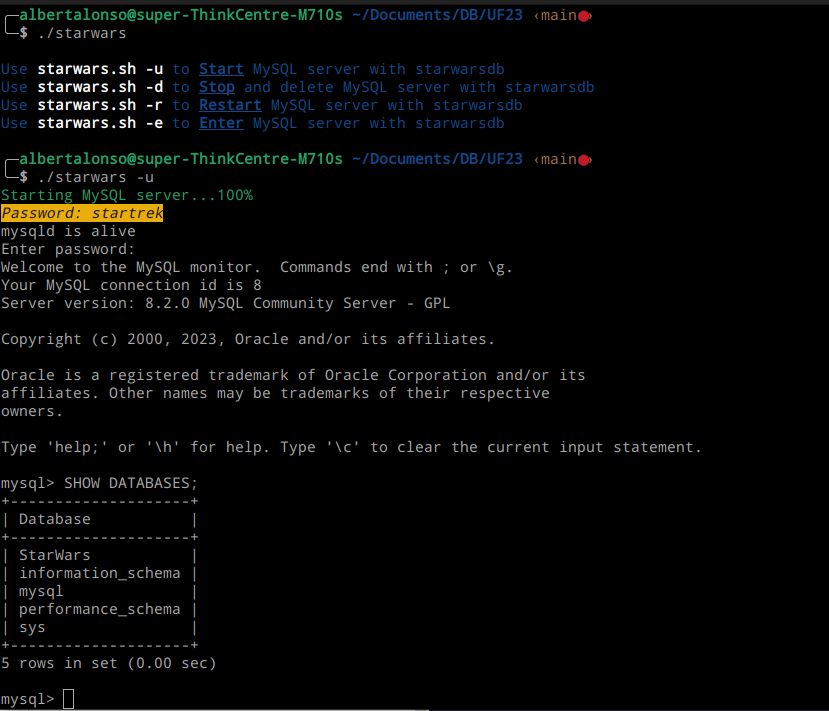

# How it works

You need to change permissions on every file in main folder.

```
chmod +x shellscriptfile
```

Every script search his own **dockerfile** inside *dockerfiles* folder to create a container.

Every dockerfile inside *dockerfiles* folder search inside *sqlfiles* folder **sql files** to create and initialize his own database.

### Example

